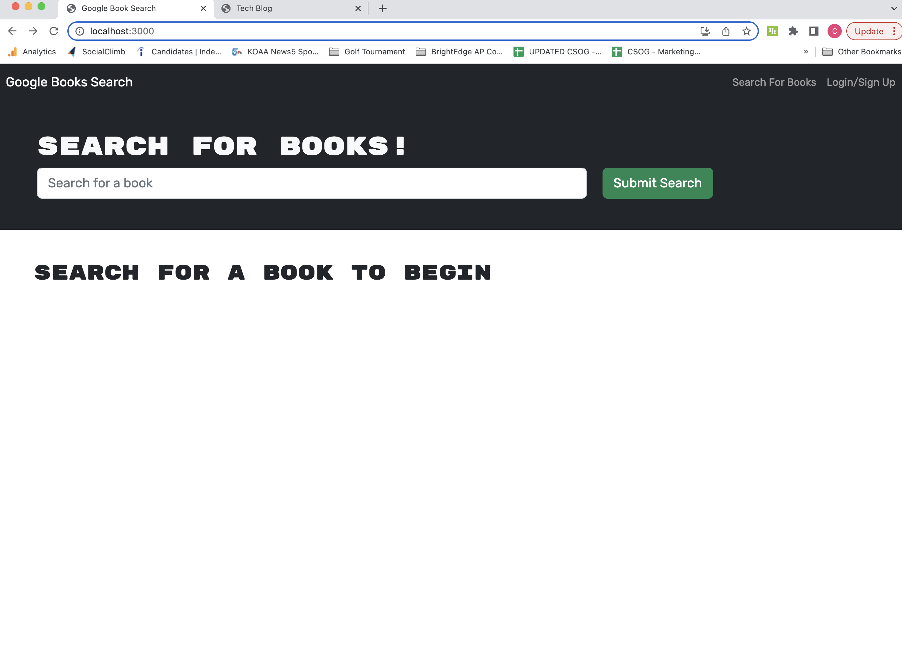
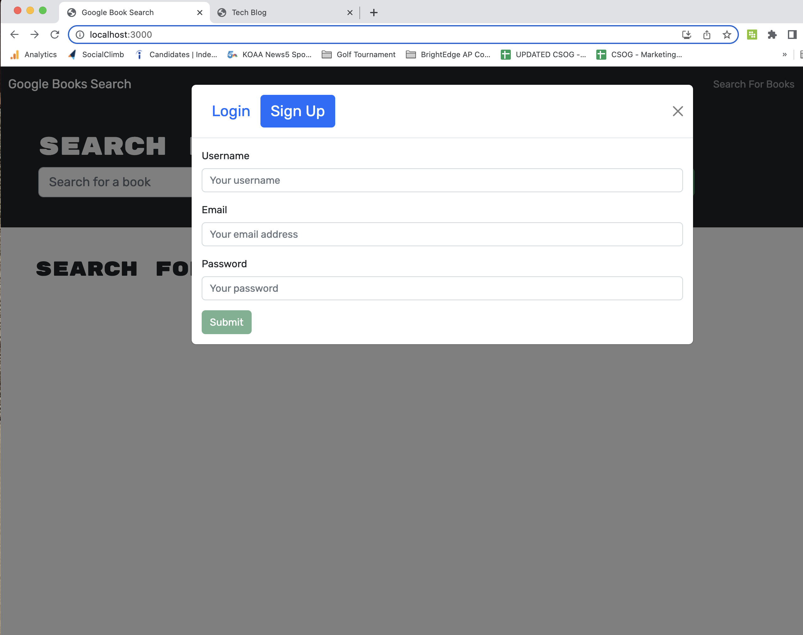
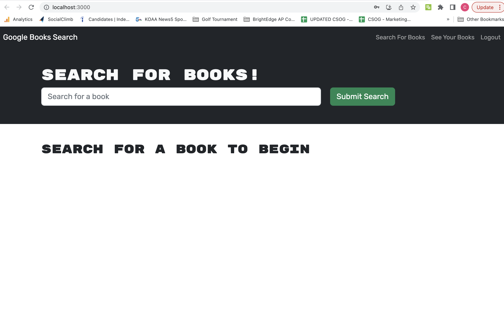
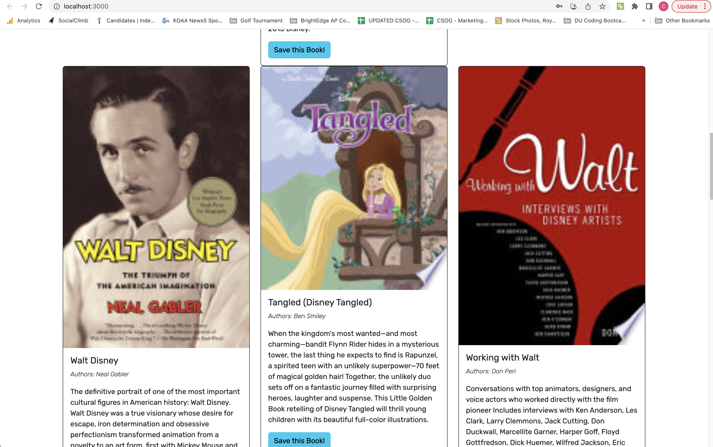

# MERN: Book Search Engine

## Homework Task

To create this React app, I took a fully functioning Google Books API search engine built with a RESTful API, and refactored it to be a GraphQL API built with Apollo Server. The app was built using the MERN stack with a React front end, MongoDB database, and Node.js/Express.js server and API.

## User Story

```md
AS AN avid reader
I WANT to search for new books to read
SO THAT I can keep a list of books to purchase
```

## Acceptance Criteria

```md
GIVEN a book search engine
WHEN I load the search engine
THEN I am presented with a menu with the options Search for Books and Login/Signup and an input field to search for books and a submit button
WHEN I click on the Search for Books menu option
THEN I am presented with an input field to search for books and a submit button
WHEN I am not logged in and enter a search term in the input field and click the submit button
THEN I am presented with several search results, each featuring a book’s title, author, description, image, and a link to that book on the Google Books site
WHEN I click on the Login/Signup menu option
THEN a modal appears on the screen with a toggle between the option to log in or sign up
WHEN the toggle is set to Signup
THEN I am presented with three inputs for a username, an email address, and a password, and a signup button
WHEN the toggle is set to Login
THEN I am presented with two inputs for an email address and a password and login button
WHEN I enter a valid email address and create a password and click on the signup button
THEN my user account is created and I am logged in to the site
WHEN I enter my account’s email address and password and click on the login button
THEN I the modal closes and I am logged in to the site
WHEN I am logged in to the site
THEN the menu options change to Search for Books, an option to see my saved books, and Logout
WHEN I am logged in and enter a search term in the input field and click the submit button
THEN I am presented with several search results, each featuring a book’s title, author, description, image, and a link to that book on the Google Books site and a button to save a book to my account
WHEN I click on the Save button on a book
THEN that book’s information is saved to my account
WHEN I click on the option to see my saved books
THEN I am presented with all of the books I have saved to my account, each featuring the book’s title, author, description, image, and a link to that book on the Google Books site and a button to remove a book from my account
WHEN I click on the Remove button on a book
THEN that book is deleted from my saved books list
WHEN I click on the Logout button
THEN I am logged out of the site and presented with a menu with the options Search for Books and Login/Signup and an input field to search for books and a submit button
```

## Mock-Up

User is initally brought to search page with user not logged in.


User can navigate to login/sign up button to login and expand search/saving capabilities


User is now logged in and can search database as desired


As you can see in the following graphic, a user can type a search term (in this case, "disney") in a search box and the results appear. A user can also save any book by clicking "Save This Book!" under each search result, as shown in the following graphic:



## Technologies Used

1. Apollo Server
2. React
3. Expresss.js
4. Node.js
5. GraphQl
6. Authenticiation

## Applicaton Links

GitHub Repo: https://github.com/chelseyvalerio/MERN-book-search-engine
Heroku Application URL: https://secret-hamlet-86447.herokuapp.com/

## Contact

Please contact me at cvalerio@csog.net with any questions. Thank you!
